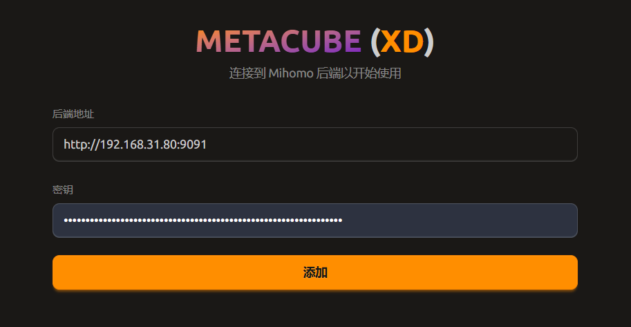
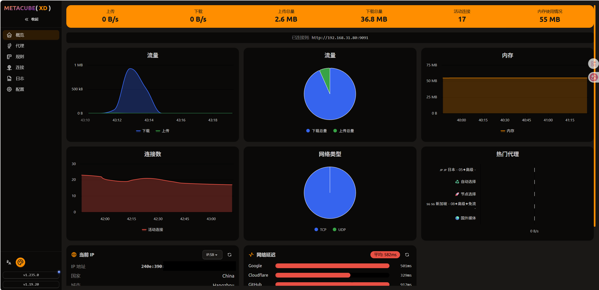

# clash-docker
简单易用的 Clash (代理) + Mihomo(Clash Meta 管理面板) docker

docker hub: https://hub.docker.com/r/hhk0571/clash-for-linux

# 使用方法

## docker run 命令

```bash
# 设置clash订阅地址和更新间隔(单位:小时)
export CLASH_SUB_URL=https://your-subscription-ur
export CLASH_UPDATE_HOURS=24 # 每24小时更新一次订阅

docker run -d \
  --name clash \
  -p 7890:7890 \
  -p 7891:7891 \
  -p 9091:9090 \
  -e CLASH_SUBSCRIPTION_URL=${CLASH_SUB_URL} \
  -e CLASH_UPDATE_HOURS=${CLASH_UPDATE_HOURS} \
  -v ./config:/app/config \
  --health-cmd "curl -f http://127.0.0.1:9090/version || exit 1" \
  --health-interval 30s \
  --health-timeout 10s \
  --health-retries 3 \
  --restart unless-stopped \
  hhk0571/clash-for-linux:latest
```

## docker compose

通常用于在NAS设备上启动docker.

配置 `docker-compose.yaml`:
```yaml
services:
  clash:
    image: hhk0571/clash-for-linux:latest
    environment:
      ## Timezone setting
      TZ: Asia/Shanghai

      ## Proxy settings/代理设置 (optional, remove if not needed/ 若无需代理, 注释掉下面这几行 )
      # HTTP_PROXY: http://10.10.10.9:8080
      # HTTPS_PROXY: http://10.10.10.9:8080
      # http_proxy: http://10.10.10.9:8080
      # https_proxy: http://10.10.10.9:8080
      # NO_PROXY: 127.0.0.1,localhost
      # no_proxy: 127.0.0.1,localhost

      ## Clash subscription URL / clash 订阅链接 (required/必填)
      CLASH_SUBSCRIPTION_URL: https://your-subscription-url
      ## Interval (in hours) to check for configuration updates (default: 8 hours)
      ## 订阅更新间隔(单位:小时, 默认:8小时)
      CLASH_UPDATE_HOURS: 24 # Update every 24 hours 每24小时更新一次

      ## Clash secret for API authentication (comment out to use config default)
      # CLASH_SECRET: your-secret-key # 仪表盘界面访问密码, 觉得必要再设置

      ## Disable DNS only when you really need to
      # DISABLE_CLASH_DNS: true # 保持注释就好, 觉得必要再设置
    ports:
      - "7890:7890"  # HTTP proxy
      - "7891:7891"  # SOCKS5 proxy
      - "9091:9090"  # External controller / Dashboard (host:port -> container:9090) / 根据需要设置宿主机端口
    volumes:
      - ./config:/app/config
    healthcheck:
      test: ["CMD", "curl", "-f", "http://127.0.0.1:9090/version"]
      interval: 30s
      timeout: 10s
      retries: 3
    restart: unless-stopped
```

## 查看UI 界面
浏览器打开 URL:  http://<宿主机地址>:9091/ui



打开后在后端地址栏填上 http://<宿主机地址>:9091
在秘钥栏填前面生成的密码, 如果为空就不填; 然后点击"添加"按钮, 即可进入仪表盘界面.


